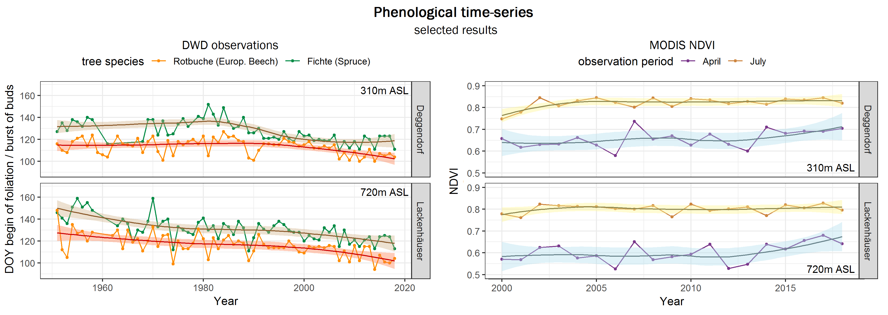
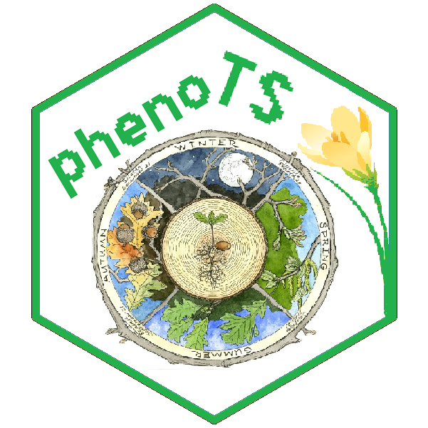

<!-- README.md is generated from README.Rmd. Please edit that file -->
phenoTS
=======

> An R package for phenological time-series analyses

This package simplifies time-series analyses based on different types of phenology data. Various functions and scripts to download, process and analyze data from two entirely different data sets are provided: field records of the German National Meteorological Service's (DWD) observation network and raster remote sensing data (especially MODIS NDVI, but with generalized functions).

### Idea

Vegetation phenology, the timing of periodic life cycle events like first flowering and leafing, provides important information for various disciplines and applications. Their temporal shifts, for example, is a simple yet widely acknowledged indicator for global warming and other environmental changes. It is also relevant to the timing of allergy seasons and cultural events, wildfires, pest outbreakd or invasive species distributions. The measurement of phenology shifts is commonly based on two entirely different yet potentially complimentary methods: in-situ observations and remote sensing. Combining the strengths of both methodologies is a promising approach to improve plant phenology monitoring.

Unfortunately, handling phenological data of different types and formats is often challenging and time-consuming. Thus, the goal of phenoTS is to simplify phenological time-series analyses using both types of data input: field observation (points) and remote sensing (raster) data.

### Installation and Getting Started

You can install the latest version of phenoTS from Github with:

``` r
devtools::install_github("malinfischer/phenoTS")
```

Have a look at the provided example scripts to get an overview on how to use this package.

For a first impression, see this example of a time-series analysis result plot for two DWD stations in the Bavarian Forest:



------------------------------------------------------------------------

 Author: Malin Sophie Fischer
