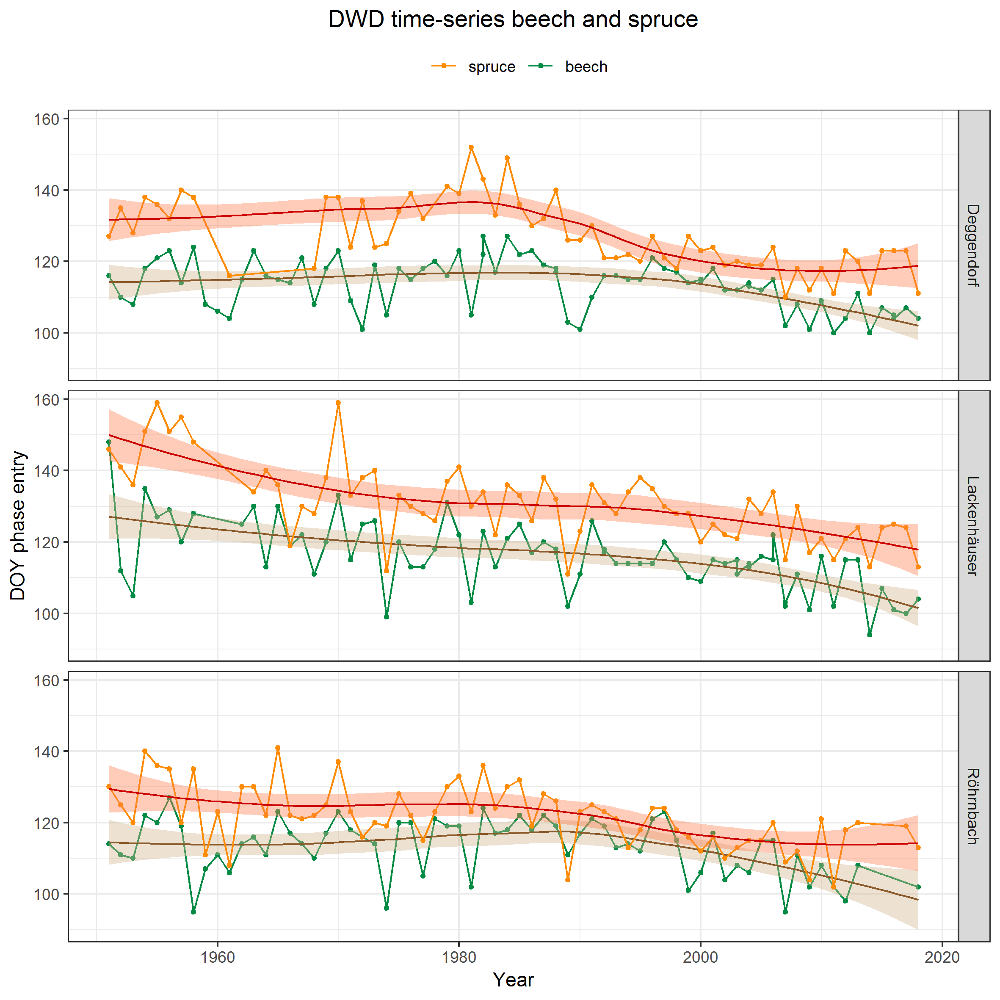

<!-- README.md is generated from README.Rmd. Please edit that file -->
phenoTS
=======

> An R package for phenological time-series analyses

This package simplifies time-series analyses based on different types of phenology data. Various functions and scripts to download, process and analyze data from two entirely different data sets are provided: field records of the German National Meteorological Service's (DWD) observation network and raster remote sensing data (especially MODIS NDVI, but with generalized functions).

### Background

Vegetation phenology, the timing of periodic life cycle events like first flowering and leafing, provides important information for various disciplines and applications. Temporal shifts, for example, are a simple yet widely acknowledged indicator for global warming and other environmental changes. They are also relevant amongst others to the timing of allergy seasons and cultural events, wildfires, pest outbreaks or invasive species distributions.
The measurement of phenology shifts is commonly based on two entirely different yet potentially complimentary data acquisition methods: in-situ observations (= point data) and remote sensing (= raster data). Combining the strengths of both methodologies is a promising approach to improve plant phenology monitoring.

Unfortunately, handling phenological data of different types and formats is often challenging and time-consuming. Thus, the goal of phenoTS is to simplify phenological time-series analyses using both of these types of data input. The methods provided focus on the handling of DWD field observation and MODIS NDVI satellite data, but are transferable to other data sets with few modifications as well.

### Installation and Getting Started

You can install the latest version of phenoTS from Github with:

``` r
devtools::install_github("malinfischer/phenoTS")
```

Have a look at the provided example scripts to get an overview on how to use this package.

For a first impression, see this example of a time-series analysis result plot for two DWD stations in the Bavarian Forest:


### DWD data - code example

See [example scripts](https://github.com/malinfischer/phenoTS/tree/master/example_scripts) for more details and MODIS NDVI example.

###### Get started

``` r
## load and activate phenoTS package from github
devtools::install_github("malinfischer/phenoTS")
library(phenoTS)

## set directory where data files shall be saved
my_dir <- "C:/Users/.../my_folder"

## check available crops  and their abbreviations
dwd_crop_list()
```

download observation + meta data from DWD's ftp-server

``` r
# crop: Rotbuche (European beech), annual + immediate reporters
dwd_download(crops="RBU", start=1900, end=2019, _
             report="JMSM", dir_out=my_dir)
```

###### Data processing

``` r
## create directory to folder containing files to be processed
folder_dir <- paste0(my_dir, "/RBU") 

## process and join all files in folder
rbu_data <- dwd_process(folder_dir)

#result: processed tidyverse tibble
```

**Note:** includes several processing phenoTS functions:

-   dwd\_read()
-   dwd\_add\_phase\_info()
-   dwd\_add\_station\_info()
-   dwd\_clean()
-   dwd\_join\_files()

###### Data filtering

**a.** general filters: select one phase, define observation period, delete closed stations

``` r
# phase 4 (begin of foliation / Blattentfaltung Beginn) selected here
# = indicator for start of greening / spring
rbu_data <- dwd_filter(rbu_data, dwd_phase_id=4, _
             obs_start=1950, obs_end=2018, obs_min=25)
```

**b.** filter specific stations

``` r
# filter flexibly using dplyr package
rbu_data <- dplyr::filter(rbu_data,_
             stat_id%in%c(11162,11292,11295))

# save selected stations as shape file
dwd_stations_shp(rbu_data,my_dir)
```

###### Plotting time-series results - one crop

``` r
rbu_plot <- dwd_plot_ts(rbu_data)
```


###### Plotting time-series results - two crops

``` r
rbu_fic_plot <- dwd_plot_2_ts(rbu_data,fic_data)
```



------------------------------------------------------------------------

 Author: Malin Sophie Fischer
