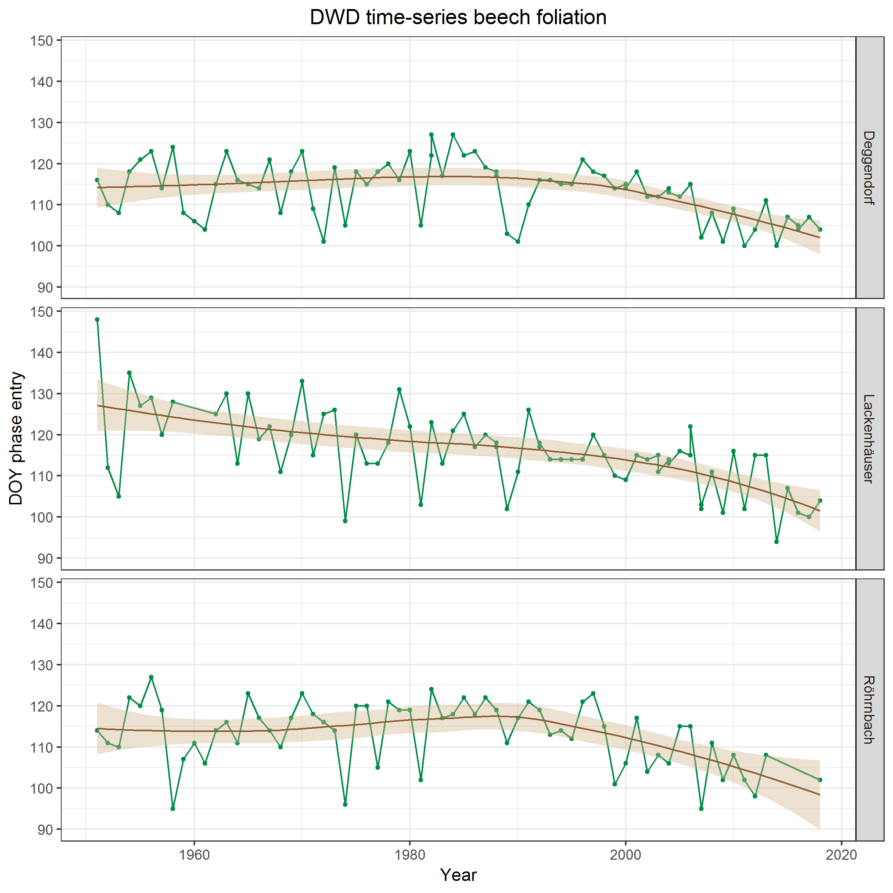
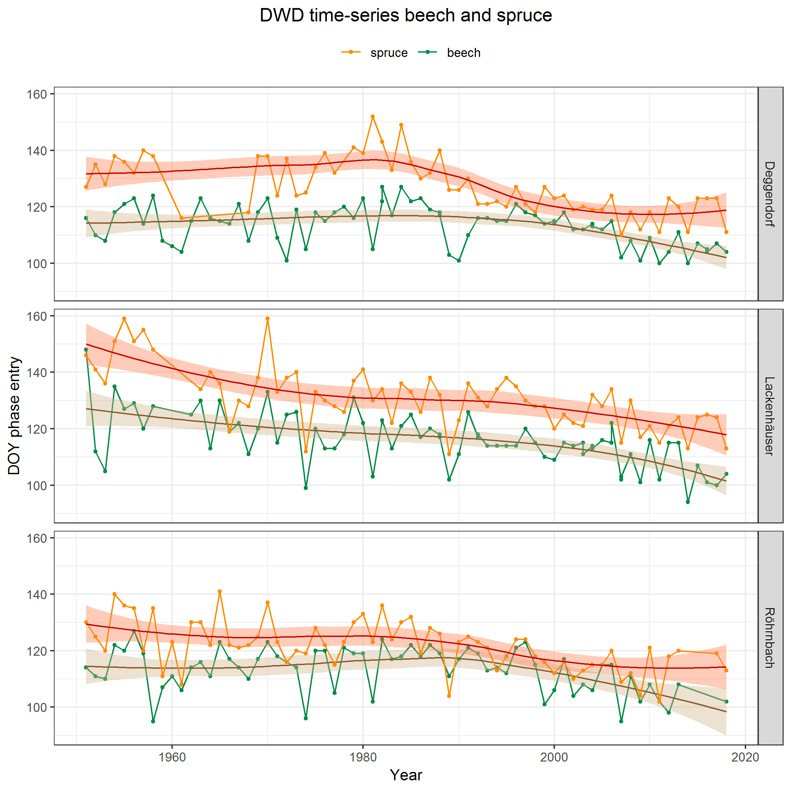

```{r setup, include=FALSE}
knitr::opts_chunk$set(echo = FALSE)
```


## Get started

```{r start, echo = TRUE, eval = FALSE, results = "hide"}
## load and activate phenoTS package from github
devtools::install_github("malinfischer/phenoTS")
library(phenoTS)

## set directory where data files shall be saved
my_dir <- "C:/Users/.../my_folder"

## check available crops  and their abbreviations
dwd_crop_list()

```

download observation + meta data from DWD's ftp-server
```{r start2, echo = TRUE, eval = FALSE, results = "hide"}
# crop: Rotbuche (European beech), annual + immediate reporters
dwd_download(crops="FIC", start=1900, end=2019, _
             report="JMSM", dir_out=my_dir)

```


## Data processing


```{r processing, echo = TRUE, eval = FALSE, results = "hide"}
## create directory to folder containing files to be processed
folder_dir <- paste0(my_dir, "/RBU") 

## process and join all files in folder
rbu_data <- dwd_process(folder_dir)

#result: processed tidyverse tibble

```

**Note:** includes several processing phenoTS functions:

- dwd_read
- dwd_add_phase_info
- dwd_add_station_info
- dwd_clean
- dwd_join_files

## Data filtering

**a.** general filters: select one phase, define observation period, delete closed stations

```{r filtering, echo = TRUE, eval = FALSE, results = "hide"}
# phase 4 (begin of foliation / Blattentfaltung Beginn) selected here
# = indicator for start of greening / spring
rbu_data <- dwd_filter(rbu_data, dwd_phase_id=4, _
             obs_start=1950, obs_end=2018, obs_min=25)
```

**b.** filter specific stations

```{r filtering2, echo = TRUE, eval = FALSE, results = "hide"}
# filter flexibly using dplyr package
rbu_data <- dplyr::filter(rbu_data,_
             stat_id%in%c(11162,11292,11295))

# save selected stations as shape file
dwd_stations_shp(rbu_data,my_dir)
```

## Plotting time-series results 

```{r plot, echo = TRUE, eval = FALSE, results = "hide"}
rbu_plot <- dwd_plot_ts(rbu_data)
```
```{r plot4, out.width='52%', fig.align='center'}


```

## Plotting time-series results | two crops
```{r plot2, echo = TRUE, eval = FALSE, results = "hide"}
rbu_fic_plot <- dwd_plot_2_ts(rbu_data,fic_data)

```
```{r plot3, out.width='52%', fig.align='center'}


```

